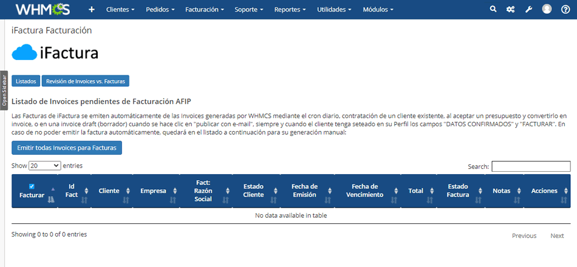

# iFactura-WHMCS

Addon Module de WHMCS para emitir facturación electrónica (AFIP) mediante el servicio de iFactura.com.ar




## Descarga

Releases: https://github.com/wnpower/iFactura-WHMCS/releases


## Introducción

Este módulo habilita a WHMCS para emitir facturas electrónicas en AFIP para todas las invoices.

Cuando se emite una nueva Invoice, si el cliente en cuestión tiene en su perfil activadas las opciones "Datos Validados" y "Facturar", WHMCS se comunicará vía API a iFactura para emitir el comprobante correspondiente y almacenará el hash de identificación en el campo "Notas" de la Invoice en cuestión. El hash hace referencia al ID del comprobante generado en iFactura para su visualización online y/o descarga en PDF.

Cuando una invoice es cancelada, si la misma fue facturada, también emite su correspondiente nota de crédito.

Para nuevos clientes a facturar, como al momento de contratar la primera Invoice se genera antes de validar los datos del cliente (por lo que la primer factura se ignora y no es emitida), se provee un panel de control en el cual se podrá facturar manualmente todas las Invoices pendientes de facturación, al igual que cualquier otra Invoice que haya fallado en la emisión automática en un determinado momento. Tambien posee una vista para revisar el estado de comprobantes que tuvieron algún problema al momento de emisión. Pudiendo enviarlas en batch o individualmente, para volver a emitirlas.


## Instalación

- Subir el directorio "ifactura_afip" en /modules/addons/

- Verificar permisos del directorio subido: # chown -R usuario:usuario ifactura_afip

- En WHMCS > Admin Area, Ajustes > Módulos Extra, activar el módulo y configurar las opciones:
  - URL: URL del servidor de iFactura (ej. https://app.ifactura.com.ar).
  - Usuario y contraseña: login de cuenta de iFactura que emitirá los comprobantes.
  - Id de punto de venta: Id de punto de venta utilizado para emitir los comprobantes (nota: deberá estar creado previamente en iFactura).
  - Id de forma de pago: Id de de forma de pago especificada en las facturas generadas (1:Contado, 2:Tarjeta de Débito, 3:Tarjeta de Crédito, 4:Cuenta Corriente, 5:Cheque, 7:Otra).
  - Auto-enviar: Activa en iFactura el auto-envío de comprobantes emitidos al cliente por e-mail.
  - Nombre de usuario de API-User de WHMCS: Colocar el nombre de usuario API-User (o admin en su defecto) de WHMCS para poder consultar por internal API.
  - Condición Impositiva: Seleccione su condición impositiva
  - Control de acceso: Seleccionar los grupos de staff de WHMCS que pueden acceder al panel de control del módulo.
  - Mes y Año desde: Seleccionar el mes y el año desde el cual se empieza a facturar. Este dato no es obligatorio, es solo una función para no tomar invoices anteriores.

Al activar el módulo se activarán los Hooks "InvoiceCreationPreEmail" e "InvoiceCancelled" para la autogeneración de los comprobantes, en prioridad "10". Al generar o cancelar correctamente un comprobante para una Invoice dada, se colocará en el campo "Notes" de la Inovice una referencia al comprobante generado.


## Customizaciones


### Modificaciones en los archivos del template de la invoice
Por defecto, los archivos de los templates están ubicados en /templates/six. Si estás utilizando otro template, realizá estas modificaciones en la carpeta de tu template.

* Archivo "**viewinvoice.tpl**":

Motivo: Transformar los campos de "notas" que hacen referencia a las facturas y notas de crédito generadas en iFactura como links al visor online.

Buscar la siguiente línea:

```
{include file="$template/includes/panel.tpl" type="info" headerTitle=$LANG.invoicesnotes bodyContent=$notes}
```

Reemplazar por:

```
{include file="$template/includes/panel.tpl" type="info" headerTitle=$LANG.invoicesnotes bodyContent=$notes|regex_replace:'/{{FacturaAFIP=([a-zA-Z0-9]*)}}/':'<a target="_blank" href="https://app.ifactura.com.ar/VerFacturaExterna/\\1">Ver Factura</a>'|regex_replace:'/{{NotaCreditoAFIP=([a-zA-Z0-9]*)}}/':'<a target="_blank" href="https://app.ifactura.com.ar/VerFacturaExterna/\\1">Ver Nota de Crédito</a>'}
```

* Archivo "**invoicepdf.tpl**":

Motivo: Transformar los campos de "notas" que hacen referencia a las facturas y notas de crédito generadas en iFactura como leyendas en el pie del invoice PDF. 

Agregar en la lína 175 el siguiente código:

```
# Notes
if ($notes) {
 
$notes = preg_replace('/{{FacturaAFIP=([a-zA-Z0-9]*)}}/', 'Este cupón tiene un comprobante fiscal asociado: <a target="_blank" href="https://app.ifactura.com.ar/Factura/ImprimirExterno/\\1">Factura Electrónica</a>', $notes);
$notes = preg_replace('/{{NotaCreditoAFIP=([a-zA-Z0-9]*)}}/', 'Este cupón tiene un comprobante fiscal asociado: <a target="_blank" href="https://app.ifactura.com.ar/Factura/ImprimirExterno/\\1">Nota de crédito</a>', $notes);
 
$pdf->Ln(5);
$pdf->SetFont('freesans', '', 8);
//$pdf->MultiCell(170, 5, Lang::trans('invoicesnotes') . ': ' . $notes);
$tblhtml = $notes;
$pdf->writeHTML($tblhtml, true, false, false, false, '');
}
```

## Notas de uso

Cuando se crea una Invoice manualmente desde el panel de WHMCS > Admin Area (y no de forma automática por whmcs), no se genera automáticamente la factura, por lo que se deberá usar la vista "Invoices pendientes de Facturación" del panel de control del módulo (Módulos > iFactura Facturación) para facturar manualmente.

Esta vista permite al usuario poder reintentar la emisión de la factura tanto individualmente como por grupos. Lo mismo ocurre con las facturas y notas de crédito que se encuentren con problemas de emisión. En caso de problemas, el detalle de los mismos sera informado al ser procesado.

## Soporte Técnico

Este addon posee soporte técnico comunitario vía la solapa "**[Issues](https://github.com/wnpower/iFactura-WHMCS/issues)**" de este mismo repositorio.
No incluye atención técnica mediante el soporte técnico oficial del servicio de iFactura.
